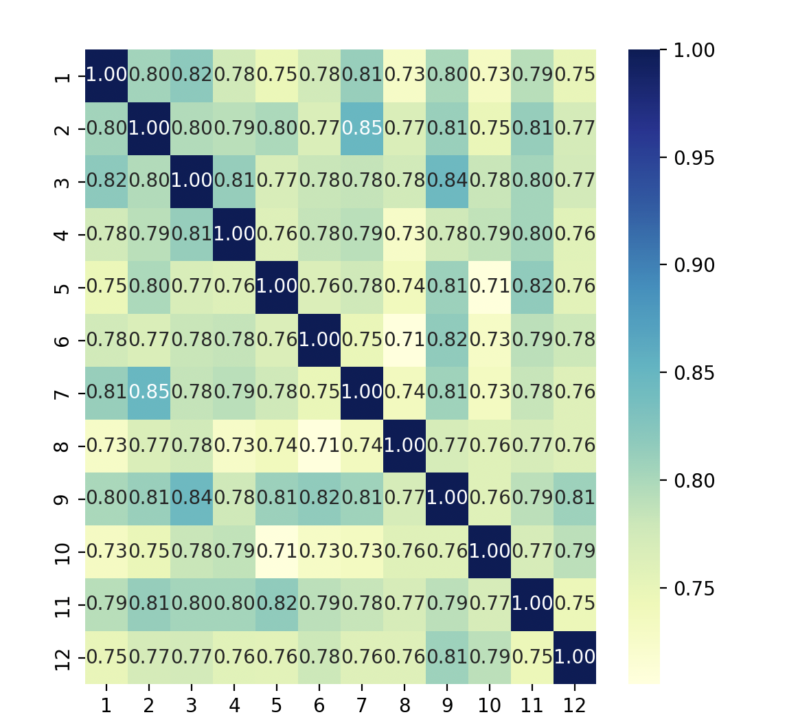

# MyHLM
NLP Project----Judge whether first 80 chapters and last 40 chapters of 红楼梦 are written by same auther using Word2vec

In this project, I manually seperate 120 chapters of 红楼梦 into 12 blocks with each having 10 chapters. I use beautifulSoup to handle raw html files, after compiling there will be a "cocked_words" folder. Word2vec model in gensim is used to train each block and will save the model in "model" folder. I use the similarity between the same words of every two block to calculate the similarity between blocks.

File description:

1. "data" folder: contains 12 blocks of 120 chapters of 红楼梦 in html format.
2. regularize_split.py: compile raw html files into txt files.
3. combine.py: combine files in one block into one file.
4. wordEmbed.py: train word2vec model for each block.
5. calculation.py: calculate the similarity between words.

Running process:

1. run combine.py
2. run wordEmbed.py
3. run calculation.py

or you can run the whole process by running main.py

The result heatmap is shown below:
